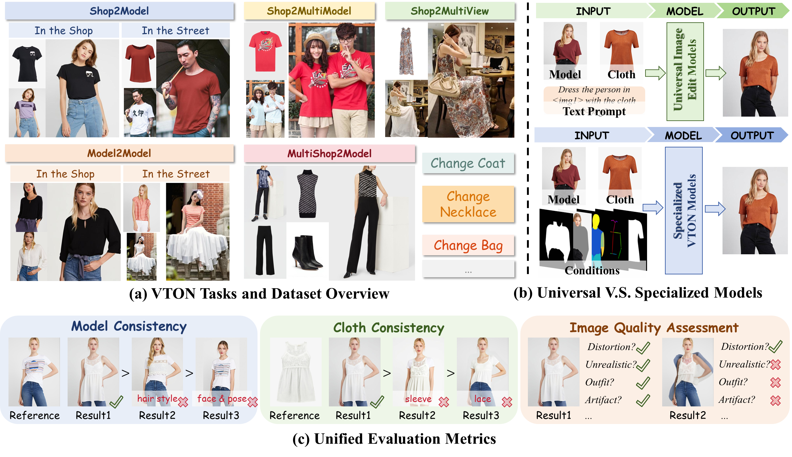

<div align="center">

# VTEdit-Bench: A Comprehensive Benchmark for Multi-Reference Image Editing Models in Virtual Try-On

### Universal Image Editors Meet Real-World Virtual Try-On

Xiaoye Liang<sup>1,2</sup>, Zhiyuan Qu<sup>1</sup>, Mingye Zou<sup>3,2</sup>, Jiaxin Liu<sup>1</sup>, Lai Jiang<sup>1</sup>, Mai Xu<sup>1</sup>, Yiheng Zhu<sup>2,†</sup>

<sup>1</sup>Beihang University,  <sup>2</sup>Zhongguancun Academy,  <sup>3</sup>Harbin Institute of Technology  

<sup>†</sup>Corresponding Author

[](https://arxiv.org/abs/2603.11734)
[](TODO)
[](LICENSE)


</div>

<p align="center">
  
</p>


---

## Introduction

**VTEdit-Bench** is a comprehensive benchmark for evaluating **universal multi-reference image editing models** in realistic virtual try-on scenarios.

Recent universal image editing models can naturally take multiple visual references and follow text instructions, making them a promising alternative to task-specific virtual try-on pipelines. However, existing VTON benchmarks mainly focus on canonical Shop-to-Model settings and are insufficient for evaluating robustness under complex real-world scenarios.

To address this gap, we introduce **VTEdit-Bench**, which contains:

- **24,220** test image pairs;
- **5** representative VTON tasks;
- **13,521** human sources;
- **10,926** clothing sources;
- auxiliary conditions for specialized VTON models;
- unified evaluation with both **FID/KID** and **VTEdit-QA**.

VTEdit-Bench covers progressively more challenging settings, including multi-view try-on, multi-person try-on, model-to-model transfer, and multi-item outfit composition.

---

## News

- `[2026/06]` VTEdit-Bench is accepted by ECCV 2026.
- `[2026/06]` Dataset lists, auxiliary conditions, and supplementary data are released.


---

## Benchmark Overview

VTEdit-Bench includes five representative virtual try-on tasks.

| Task | Description | Main Challenge |
|---|---|---|
| **Shop2Model** | Transfer a shop garment to a target model image. | Standard virtual try-on |
| **Shop2MultiView** | Transfer a shop garment to a model under diverse viewpoints. | Viewpoint robustness |
| **Shop2MultiModel** | Transfer a shop garment to multi-person scenes. | Multi-subject consistency |
| **Model2Model** | Transfer clothing from one person image to another person image. | Clothing extraction and identity preservation |
| **MultiShop2Model** | Compose multiple shop items onto one person. | Multi-item binding and global coherence |

---

## Dataset

VTEdit-Bench is built from several public VTON/fashion datasets, manually selected samples, and additional web-collected supplementary data.

### Data Composition

| Task | Test Pairs | Human Source | Clothing Source |
|---|---:|---|---|
| **Shop2Model** | 9,521 | DressCode, VITON-HD, StreetVTON | DressCode, VITON-HD |
| **Shop2MultiView** | 2,000 | DeepFashion + web supplement | DressCode |
| **Shop2MultiModel** | 2,000 | DeepFashion + web supplement | DressCode |
| **Model2Model** | 8,299 | VITON-HD, StreetVTON | VITON-HD, StreetVTON |
| **MultiShop2Model** | 2,400 | DressCode-MR | DressCode-MR |

### Original Dataset Sources

For images derived from existing datasets, please download the original data from their official sources.

| Dataset | Link | Usage |
|---|---|---|
| **DressCode** | https://github.com/aimagelab/dress-code | Shop images and indoor model images |
| **VITON-HD** | https://github.com/shadow2496/VITON-HD | High-resolution model and garment images |
| **StreetVTON** | https://github.com/cuiaiyu/street-tryon-benchmark | Outdoor in-the-wild model images |
| **DeepFashion** | https://mmlab.ie.cuhk.edu.hk/projects/DeepFashion.html | Multi-view and multi-person model sources |
| **DressCode-MR** | https://huggingface.co/datasets/zhengchong/DressCode-MR | Multi-reference outfit-level try-on |

### Released Google Drive Package

We provide the benchmark data and pair lists through Google Drive:

**Google Drive:** `Coming soon`

The released package is organized as **one subfolder per data source**, with **five task-level pair list files** at the root. Each `{task}_pairs.txt` specifies how to read the test pairs for the corresponding benchmark task from the subfolders below.

#### Package Layout

```text
VTEdit-bench/
├── shop2model_pairs.txt
├── shop2multiview_pairs.txt
├── shop2multimodel_pairs.txt
├── model2model_pairs.txt
├── multishop2model_pairs.txt
│
├── Dresscode/          # DressCode (shop + indoor model images)
├── VITONHD/            # VITON-HD (high-resolution model + garment images)
├── streetvton/         # StreetVTON (outdoor in-the-wild model images)
├── multi_view/         # DeepFashion multi-view sources + DressCode garments
├── multi_human/        # DeepFashion multi-person sources + DressCode garments
├── dresscodeMR/        # DressCode-MR (multi-reference outfit try-on)
```

#### Data Source Subfolders

| Subfolder | Original Source | Contents |
|---|---|---|
| **Dresscode/** | [DressCode](https://github.com/aimagelab/dress-code) | Shop and indoor model images for `upper_body`, `lower_body`, and `dresses`; auxiliary conditions (e.g., agnostic masks, cloth masks) where applicable |
| **VITONHD/** | [VITON-HD](https://github.com/shadow2496/VITON-HD) | High-resolution paired model and garment images under `train/` |
| **streetvton/** | [StreetVTON](https://github.com/cuiaiyu/street-tryon-benchmark) | Outdoor model images, annotations, and StreetVTON–VITON-HD cross-dataset pairs |
| **multi_view/** | [DeepFashion](https://mmlab.ie.cuhk.edu.hk/projects/DeepFashion.html) + DressCode + web supplement | Multi-view human images, corresponding DressCode garment references, and web-collected models under `web/` |
| **multi_human/** | DeepFashion + DressCode + web supplement | Multi-person human images, corresponding DressCode garment references, and web-collected models under `web/` |
| **dresscodeMR/** | [DressCode-MR](https://huggingface.co/datasets/zhengchong/DressCode-MR) | Person images, multi-item reference garments, and task-specific annotations |

> **Note:** For images derived from public datasets, please also download the original data from the official sources listed above when required.

#### Task Pair Lists

Each root-level `{task}_pairs.txt` is the entry point for loading test pairs of one benchmark task. Paths inside these files are relative to the corresponding data source subfolders.

| Task | Pair List | Involved Data Sources |
|---|---|---|
| **Shop2Model** | `shop2model_pairs.txt` | Dresscode, VITONHD, streetvton |
| **Shop2MultiView** | `shop2multiview_pairs.txt` | multi_view, Dresscode |
| **Shop2MultiModel** | `shop2multimodel_pairs.txt` | multi_human, Dresscode |
| **Model2Model** | `model2model_pairs.txt` | VITONHD, streetvton |
| **MultiShop2Model** | `multishop2model_pairs.txt` | dresscodeMR |

For most tasks, each line in a pair list contains two paths separated by whitespace (**garment/cloth first, model/person second**). Paths are relative to the `VTEdit-bench/` package root. For **MultiShop2Model**, each line lists all reference garment paths first, followed by the target person path. Web-collected model images are stored under the corresponding task folder and numbered sequentially, e.g. `multi_view/web/0001.png` for Shop2MultiView and `multi_human/web/0001.png` for Shop2MultiModel.

---

## Auxiliary Conditions

Specialized VTON models often require task-specific auxiliary inputs. To enable fair comparison, we provide the following conditions within the corresponding data source subfolders when applicable.

| Condition | Description | Typical Location |
|---|---|---|
| **OpenPose / DWPose** | Human keypoint annotations | `dwpose/`, `annos/` |
| **Human Parse** | Semantic human parsing maps | `image-parse-v3/`, `annotations/atr/`, `annotations/lip/` |
| **DensePose** | Dense human body correspondence maps | `image-densepose/`, `annotations/densepose/` |
| **Agnostic Mask** | Binary mask that removes clothing regions from the model image | `agnostic_masks/`, `agnostic-mask/` |
| **Human Agnostic** | Human image with target clothing region masked out | `agnostic-v3.2/`, `agnostic/` |
| **Cloth Mask** | Binary mask of the garment image | `cloth-mask/`, `cloth/` |

---


## Evaluation

VTEdit-Bench supports both distribution-level evaluation and reference-aware semantic evaluation.

### Evaluation Metrics

| Metric | Description |
|---|---|
| **FID** | Measures distributional similarity between generated outputs and target model-image distribution |
| **KID** | Kernel-based distributional distance |
| **Model Consistency** | Evaluates whether identity, body shape, and pose are preserved |
| **Cloth Consistency** | Evaluates whether garment color, texture, category, and structure are preserved |
| **Image Quality** | Evaluates realism, artifacts, deformation, and visual plausibility |
| **VTEdit-QA Overall** | Aggregated score using the minimum of model consistency, cloth consistency, and image quality |

---

## Evaluated Models


### Universal Multi-Reference Image Editing Models

- [Qwen-Image-Edit-2511](https://github.com/QwenLM/Qwen-Image)
- [Uniworld](https://arxiv.org/abs/2506.03147)
- [Flux.2](https://bfl.ai/blog/flux-2)
- [Flux.2-klein](https://huggingface.co/black-forest-labs)
- [DreamOmni2](https://arxiv.org/abs/2510.06679)
- [OmniGen2](https://github.com/VectorSpaceLab/OmniGen2)
- [UNO](https://arxiv.org/abs/2504.02160)
- [DreamO](https://arxiv.org/abs/2504.16915)

### Specialized VTON Models

- [IDM-VTON](https://idm-vton.github.io/)
- [StableVITON](https://github.com/rlawjdghek/StableVITON)
- [ITA-MDT](https://arxiv.org/abs/2503.20418)
- [OOTD-Diffusion](https://github.com/levihsu/OOTDiffusion)
- [CatVTON](https://github.com/Zheng-Chong/CatVTON)
- [Any2AnyTryon](https://logn-2024.github.io/Any2anyTryonProjectPage/)
- [FastFit](https://arxiv.org/abs/2508.20586)


---

## Results

### FID/KID Results

Lower FID/KID is better. Lower average rank is better.

| Method | Type | S2M FID/KID | S2MV FID/KID | S2MM FID/KID | M2M FID/KID | MS2M FID/KID | Avg. Rank |
|---|---|---:|---:|---:|---:|---:|---:|
| IDM-VTON | Specialized | 7.40 / 2.61 | 42.90 / 8.37 | 73.90 / 14.65 | - | - | 5.4 |
| StableVITON | Specialized | 16.86 / 7.24 | 37.95 / 5.01 | 111.44 / 53.58 | - | - | 8.6 |
| ITA-MDT | Specialized | 12.23 / 5.60 | 69.36 / 31.72 | 143.61 / 90.38 | - | - | 10.4 |
| OOTD-Diffusion | Specialized | 7.49 / 2.36 | 67.94 / 22.70 | 90.57 / 26.52 | - | - | 7.6 |
| CatVTON | Specialized | 10.82 / 6.95 | 43.28 / 10.54 | 76.30 / 20.03 | 14.98 / 8.79 | - | 5.4 |
| Any2AnyTryon | Specialized | 11.37 / 7.19 | 48.99 / 19.88 | 86.12 / 35.68 | - | - | 9.2 |
| FastFit | Specialized | 9.56 / 3.56 | 49.42 / 12.30 | 81.67 / 17.67 | - | **11.11 / 1.53** | 4.8 |
| Qwen-Image-Edit-2511 | Universal | 9.53 / 4.17 | 43.48 / 7.88 | 71.46 / 13.14 | **13.36 / 4.43** | 46.81 / 21.60 | 3.0 |
| Uniworld | Universal | 38.73 / 24.63 | 64.38 / 29.54 | 80.83 / 24.91 | 27.68 / 10.08 | - | 9.2 |
| Flux.2 | Universal | 10.88 / 6.54 | **36.51 / 7.26** | **65.81 / 13.68** | 14.51 / 7.62 | 15.85 / 5.36 | **2.2** |
| DreamOmni2 | Universal | 27.41 / 14.36 | 91.79 / 45.58 | 115.67 / 43.89 | 32.36 / 12.84 | 18.77 / 6.10 | 9.8 |
| OmniGen2 | Universal | 34.04 / 25.42 | 81.32 / 54.24 | 83.23 / 32.47 | 37.59 / 26.68 | 35.78 / 18.61 | 10.0 |
| UNO | Universal | 32.77 / 19.87 | 70.28 / 29.97 | 93.43 / 36.24 | 29.37 / 15.63 | 53.38 / 28.71 | 10.4 |
| DreamO | Universal | 14.91 / 7.74 | 60.54 / 22.89 | 91.66 / 27.31 | 24.62 / 11.38 | 20.53 / 8.94 | 7.4 |
| Flux.2-klein | Universal | 11.92 / 8.17 | 44.03 / 12.55 | 79.23 / 24.79 | 17.57 / 11.60 | 16.46 / 7.33 | 5.6 |

### VTEdit-QA Overall Scores

Higher is better.

| Method | Type | Shop2Model | Shop2MultiView | Shop2MultiModel | Model2Model | MultiShop2Model |
|---|---|---:|---:|---:|---:|---:|
| IDM-VTON | Specialized VTON | 3.60 | 2.73 | 1.65 | - | - |
| CatVTON | Specialized VTON | 3.39 | 2.14 | 1.26 | **2.25** | - |
| FastFit | Specialized VTON | 3.08 | 1.74 | 1.18 | - | **2.90** |
| DreamO | Universal Editor | 1.62 | 0.96 | 0.74 | 0.90 | 0.01 |
| Qwen-Image-Edit-2511 | Universal Editor | 3.64 | 2.46 | 2.14 | 1.17 | 0.34 |
| Flux.2 | Universal Editor | 3.36 | 3.38 | 3.02 | 2.06 | 2.25 |
| Flux.2-klein | Universal Editor | **3.96** | **3.99** | **3.56** | 1.03 | 2.68 |
---

## Citation

If you find VTEdit-Bench useful in your research, please consider citing:

```bibtex
@article{liang2026vtedit,
  title={VTEdit-Bench: A Comprehensive Benchmark for Multi-Reference Image Editing Models in Virtual Try-On},
  author={Liang, Xiaoye and Qu, Zhiyuan and Zou, Mingye and Liu, Jiaxin and Jiang, Lai and Xu, Mai and Zhu, Yiheng},
  journal={arXiv preprint arXiv:2603.11734},
  year={2026}
}
```
